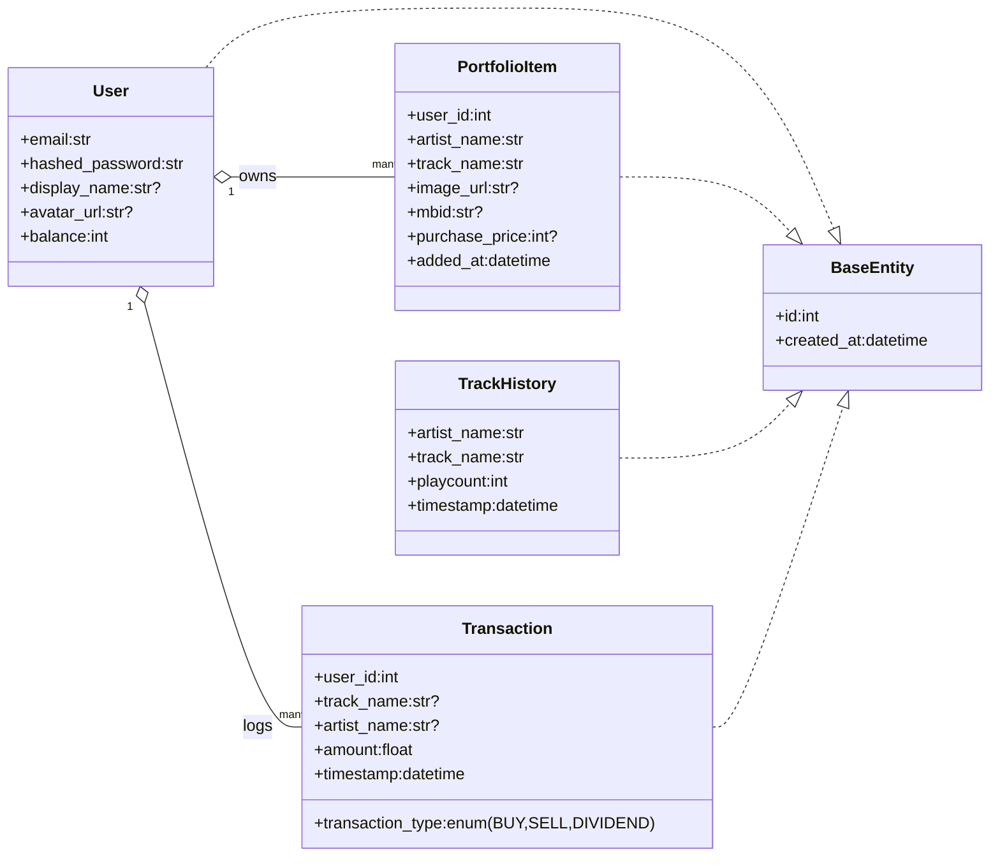
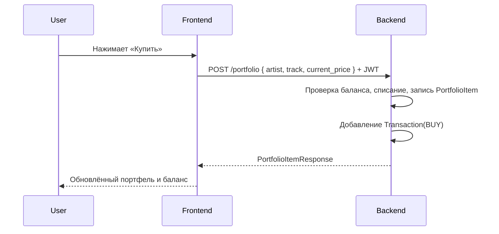
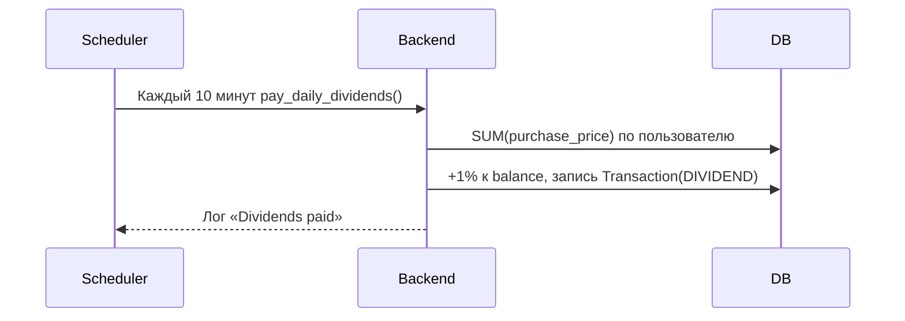

# SoundStock — спецификация сервиса

## 1) Описание API интерфейса
- База: FastAPI, JSON, авторизация через Bearer JWT
- Бэкенд код: [main.py](file:///c:/Users/a27li/Documents/GitHub/SoundStock/backend/app/main.py), модели: [models.py](file:///c:/Users/a27li/Documents/GitHub/SoundStock/backend/app/models.py), схемы: [schemas.py](file:///c:/Users/a27li/Documents/GitHub/SoundStock/backend/app/schemas.py)

### Auth
- POST /register
  - Тело: { email, password }
  - Ответ: UserResponse
  - Код: [register](file:///c:/Users/a27li/Documents/GitHub/SoundStock/backend/app/main.py#L46-L66)
- POST /token
  - Форм‑данные: username=email, password
  - Ответ: { access_token, token_type }
  - Код: [login_for_access_token](file:///c:/Users/a27li/Documents/GitHub/SoundStock/backend/app/main.py#L68-L90)

### Профиль
- GET /me
  - Auth: Bearer
  - Ответ: UserProfile
  - Код: [get_me](file:///c:/Users/a27li/Documents/GitHub/SoundStock/backend/app/main.py#L157-L162)
- PUT /me
  - Auth: Bearer
  - Тело: { display_name?, avatar_url? }
  - Ответ: UserProfile
  - Код: [update_me](file:///c:/Users/a27li/Documents/GitHub/SoundStock/backend/app/main.py#L164-L177)
- DELETE /me
  - Auth: Bearer
  - Ответ: { detail }
  - Код: [delete_me](file:///c:/Users/a27li/Documents/GitHub/SoundStock/backend/app/main.py#L191-L203)
- POST /me/reset
  - Auth: Bearer
  - Действие: сброс баланса к дефолтному значению, удаление всех активов и транзакций
  - Ответ: { detail, new_balance }
  - Код: [reset_me](file:///c:/Users/a27li/Documents/GitHub/SoundStock/backend/app/main.py)

### Портфель
- GET /portfolio
  - Auth: Bearer
  - Ответ: PortfolioItemResponse[]
  - Код: [get_portfolio](file:///c:/Users/a27li/Documents/GitHub/SoundStock/backend/app/main.py#L92-L102)
- POST /portfolio
  - Auth: Bearer
  - Тело: { artist_name, track_name, image_url?, mbid?, current_price }
  - Действие: покупка актива, списание current_price с баланса, запись транзакции BUY
  - Ответ: PortfolioItemResponse
  - Код: [add_portfolio_item](file:///c:/Users/a27li/Documents/GitHub/SoundStock/backend/app/main.py#L104-L136)
- DELETE /portfolio/{track_name}?current_price=INT
  - Auth: Bearer
  - Действие: продажа актива по текущей цене, возврат средств, запись транзакции SELL
  - Ответ: { detail }
  - Код: [delete_portfolio_item](file:///c:/Users/a27li/Documents/GitHub/SoundStock/backend/app/main.py#L138-L156)

### Лидерборд
- GET /leaderboard
  - Ответ: LeaderboardItem[] (rank, username, net_worth, balance, total_dividends, avatar_url)
  - Правило: Net Worth = balance + SUM(purchase_price)
  - Код: [get_leaderboard](file:///c:/Users/a27li/Documents/GitHub/SoundStock/backend/app/main.py#L204-L234)

### История и рынок
- GET /history/{artist}/{track}
  - Ответ: TrackHistoryPoint[]
  - Код: [get_history](file:///c:/Users/a27li/Documents/GitHub/SoundStock/backend/app/main.py#L236-L246)
- GET /market/snapshot
  - Ответ: MarketSnapshotItem[]
  - Логика: текущая цена = последний playcount; change24h = % к срезу ≥24ч назад; is_positive — знак изменения
  - Код: [market_snapshot](file:///c:/Users/a27li/Documents/GitHub/SoundStock/backend/app/main.py#L248-L306)

### Транзакции
- **GET /transactions**
  - **Описание:** Возвращает историю операций пользователя с пагинацией.
  - **Параметры:**
    - `page` (int, default=1) — номер страницы.
    - `size` (int, default=50) — элементов на странице.
  - **Ответ:** `TransactionList` (JSON):
    ```json
    {
      "items": [ ... ],
      "total": 100,
      "page": 1,
      "size": 50
    }
    ```
  - **Код:** [main.py](file:///c:/Users/a27li/Documents/GitHub/SoundStock/backend/app/main.py), [schemas.py](file:///c:/Users/a27li/Documents/GitHub/SoundStock/backend/app/schemas.py)

### Фоновые задачи
- Обновление рынка: каждый час, Last.fm Top Tracks → TrackHistory
  - Код: [update_market_data](file:///c:/Users/a27li/Documents/GitHub/SoundStock/backend/app/worker.py#L10-L46)
- Дивиденды: каждые 10 минут, начисление 1% от суммы purchase_price портфеля
  - Код: [pay_daily_dividends](file:///c:/Users/a27li/Documents/GitHub/SoundStock/backend/app/worker.py#L48-L84)

## 2) Базовые классы модели
- Концептуальный слой домена (упрощённая UML‑модель, не обязательная кодавая наследственность)



- Реальные классы в проекте:
  - SQLAlchemy: [models.py](file:///c:/Users/a27li/Documents/GitHub/SoundStock/backend/app/models.py)
  - Pydantic схемы: [schemas.py](file:///c:/Users/a27li/Documents/GitHub/SoundStock/backend/app/schemas.py)

## 3) Диаграммы взаимодействия пользователя

### Основной сценарий
```mermaid
flowchart LR
U[Пользователь] -->|Регистрация| API[/POST /register/]
U -->|Логин| API2[/POST /token/]
API2 -->|JWT| U
U -->|Открыть рынок| API3[/GET /market/snapshot/]
U -->|Детали трека| API4[/GET /history/{artist}/{track}/]
U -->|Купить| API5[/POST /portfolio/]
U -->|Продать| API6[/DELETE /portfolio/{track_name}?current_price/]
U -->|Мой профиль| API7[/GET /me/]
U -->|Обновить профиль| API8[/PUT /me/]
U -->|Лидерборд| API9[/GET /leaderboard/]
U -->|Мои операции| API10[/GET /transactions/]
```

### Последовательность «Покупка актива»


### Последовательность «Дивиденды»


### Контекстная диаграмма
```mermaid
graph LR
A[Пользователь] -- JWT --> B[Frontend (Vue)]
B -- REST --> C[Backend (FastAPI)]
C -- SQLAlchemy --> D[(Postgres)]
C -- HTTP --> E[Last.fm API]
```

## Примечания по интеграции фронтенда
- Библиотека для Last.fm: [src/services/api.ts](file:///c:/Users/a27li/Documents/GitHub/SoundStock/src/services/api.ts)
- Вызовы к бэкенду: [src/services/backend.ts](file:///c:/Users/a27li/Documents/GitHub/SoundStock/src/services/backend.ts)
- Маршруты приложения: [router](file:///c:/Users/a27li/Documents/GitHub/SoundStock/src/router/index.ts)
